# SDPBWrap

A user friendly mathematica (MMA) wrapper of the SemiDefinite Program optimizer for Bootstrap (SDPB), plus the useful Memorize tool and S-matrix bootsrap example projects.

## Capabilites provided by SDPBWrap.m

Main functions:
* **Optimizer**: An MMA wrapper for one line usage of SDPB (and eventually other methods): Optimizer[problem..., method...], with methods: "SDPB", "MMAExact", "MMANumerical", "SDPBClusterStart", "SDPBClusterStart", "SDPBCluster".
* **Memorize**: An MMA function that allow automatic storage of functions with lengthy evaluations: Memorize[f][args...]. First run evaluates f[args...] and store the result. Next evaluations retrieve the value from the database. 

## Projects developped in MAIN.nb
* Toy circle problem: proof of concept: 
  * Solve exactly and numerically using pure MMA.
  * Solve using SDPB on local + cluster.
* 1+1d bootrap: basic implementation: 
  * Implement the 2D problem
  * Make almond plot with SDPB
  * Compare with exact result
* 2+1d bootstrap: advanced implementation:
  * Implement the 3D problem
  * Make basic almond plots
  * Make basic amplitude plots
* 3+1d bootstrap: advanced implementation:
  * Implement the 4D problem
  * Solve C0max=2.66
  * Make basic almond plots
  * Make basic amplitude plots
* d>3+1 bootstrap: advanced implementation:
  * Make basic almond plots
  * Make basic amplitude plots
  
## Install
The main package file is SDPBWrap.m, just import it in MMA and use the Optimizer and Memorize functions. 
Please see INSTALL.md for user friendly installation procedure of SDPB and its dependancies on Ubuntu 22.04. 
If PWI+SQL are used, it will generate a database.sqlite file where all grid based functions can be stored.
Required additional file for cluster usage: sdpb_3.x.x.sif.
  
## Results obtained in 3d

  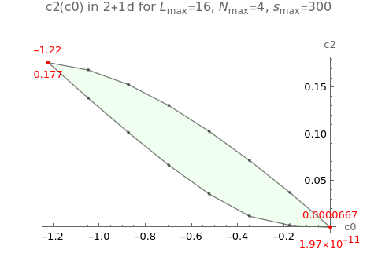
  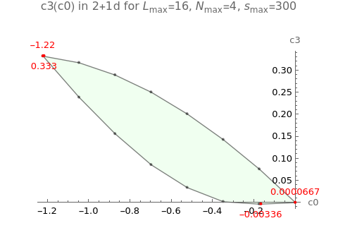

  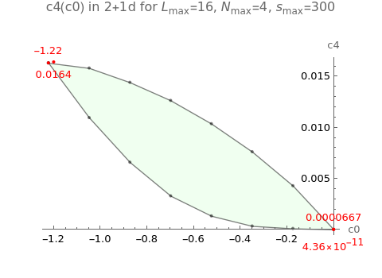
  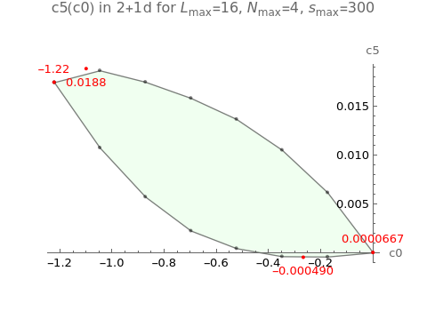

  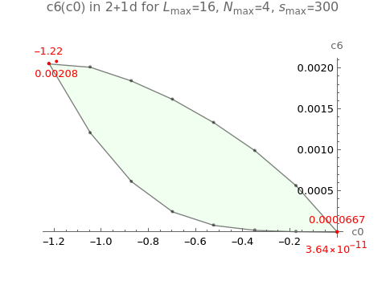
  

  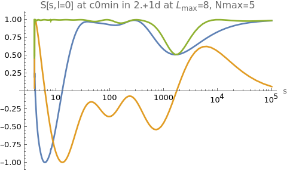
  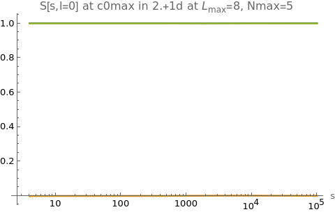

  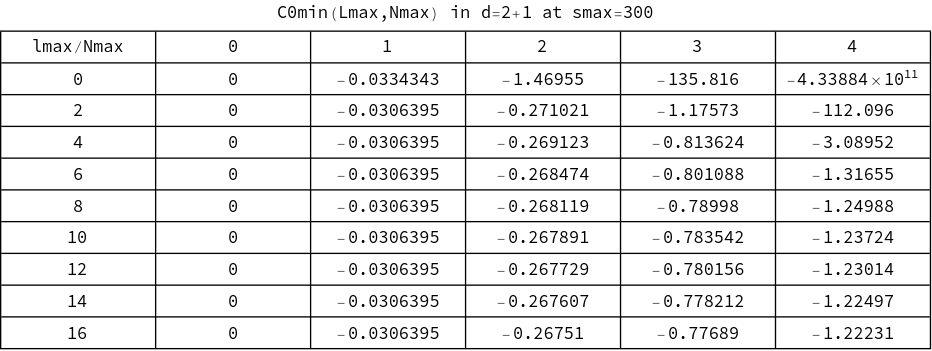
  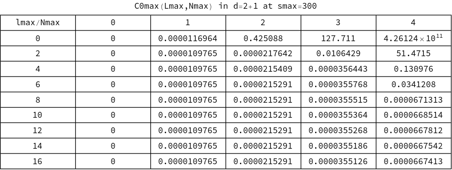

## Results obtained in 4d

  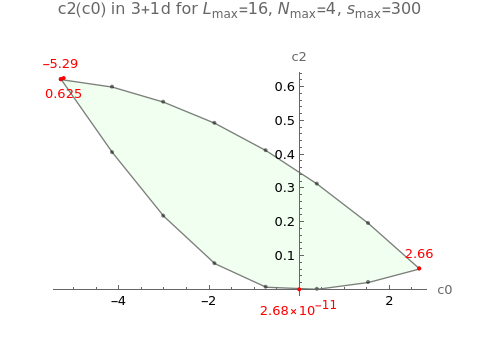
  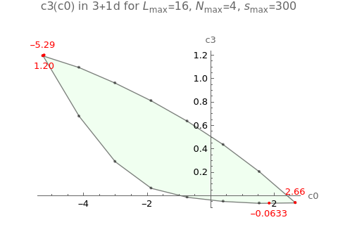

  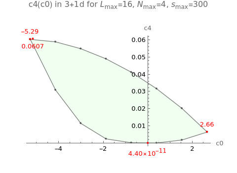
  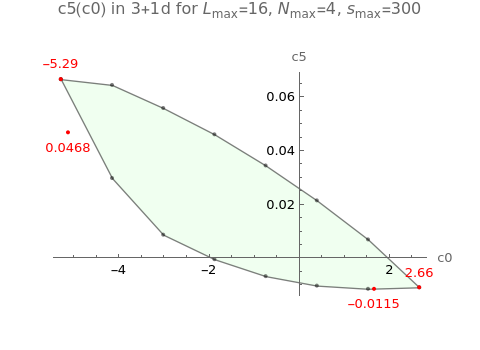

  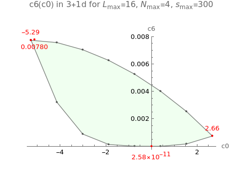
  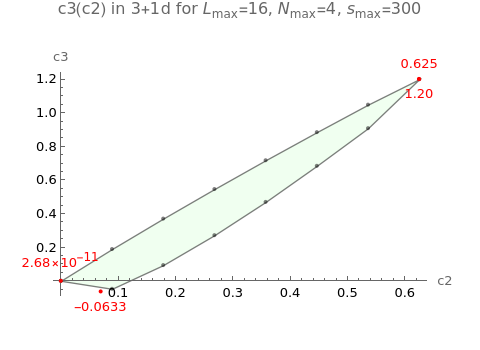

  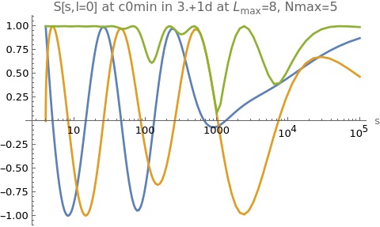
  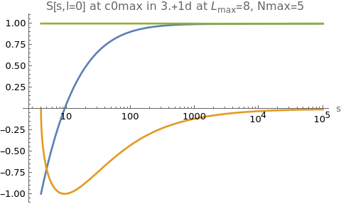

  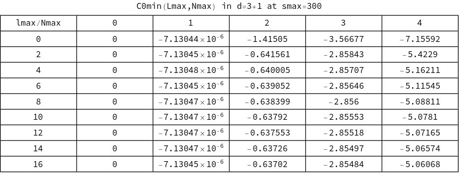
  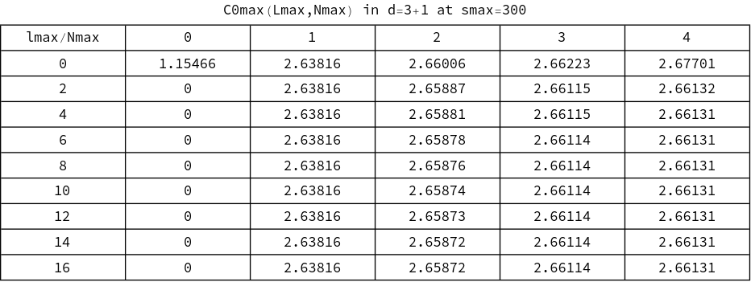

## C0max in d=3,...,11

  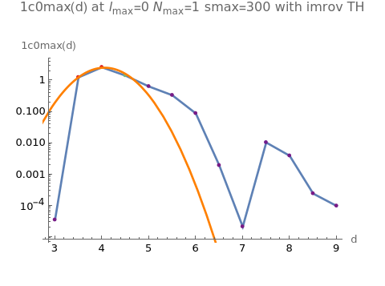

  
  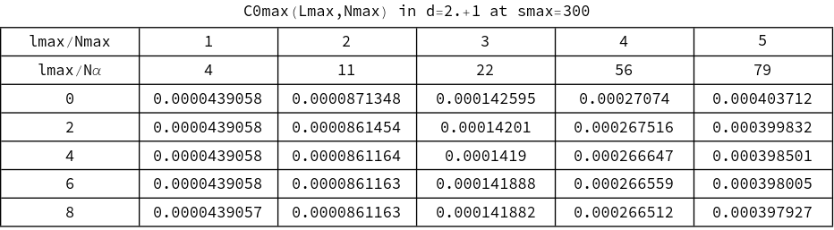

  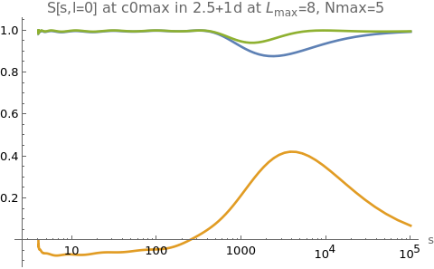
  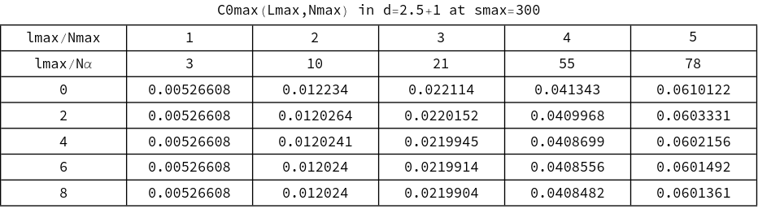

  
  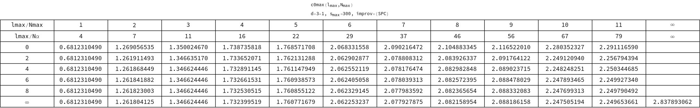

  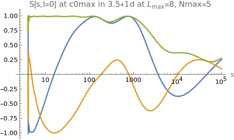
  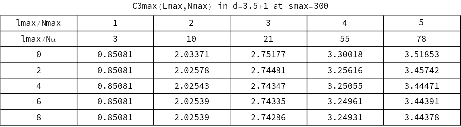

  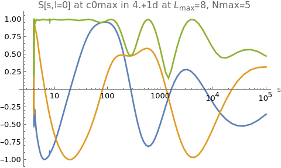
  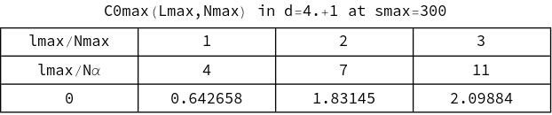

  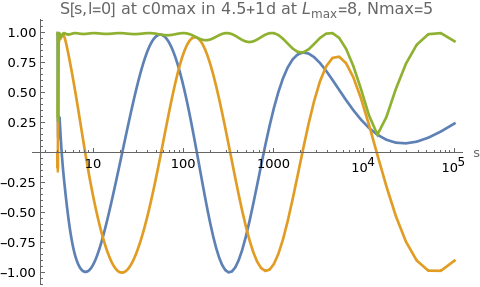
  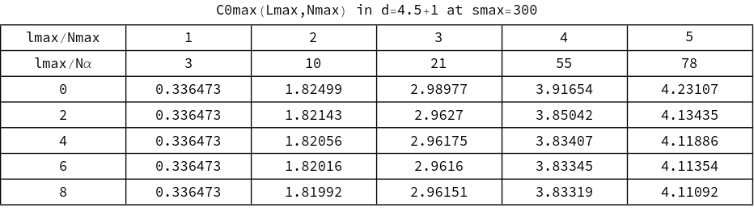

  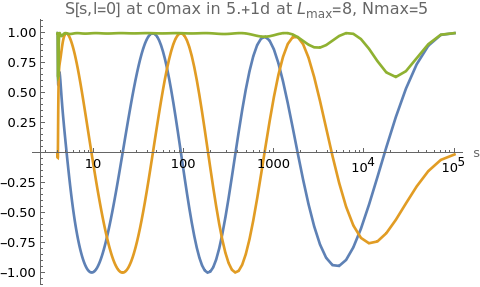
  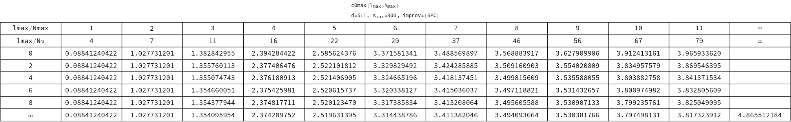

  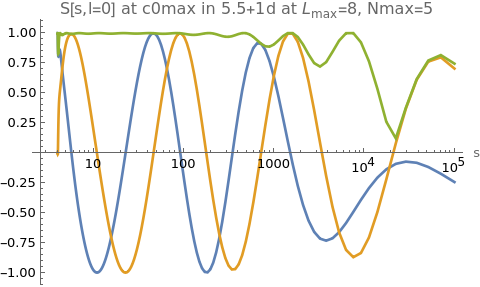
  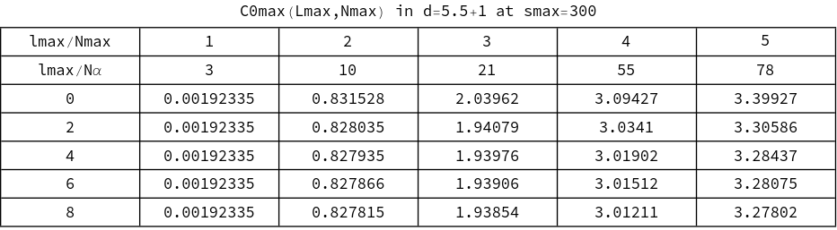

  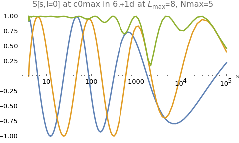
  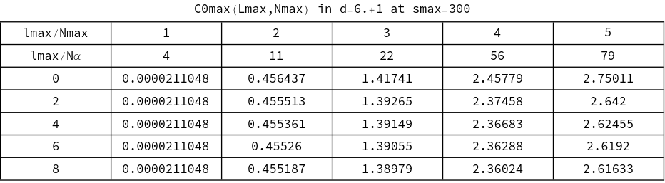

  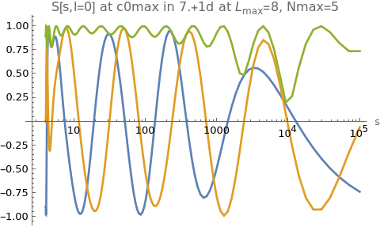
  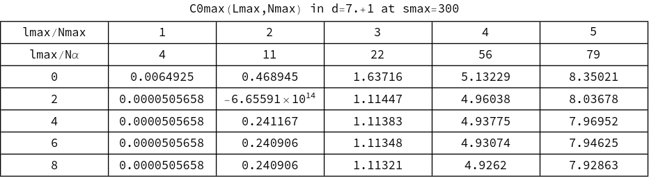

  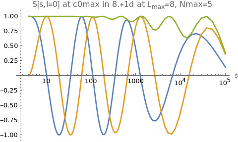
  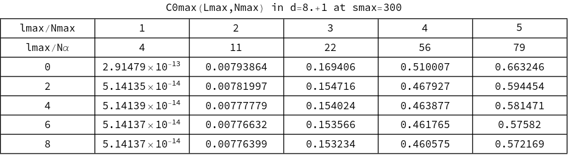

  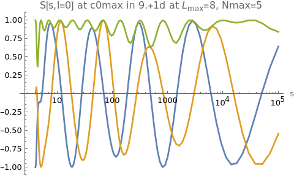
  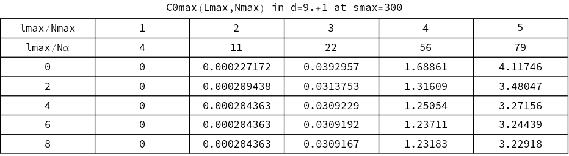

  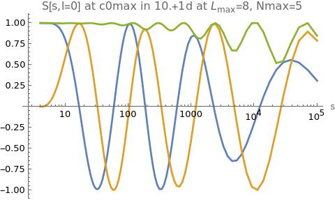
  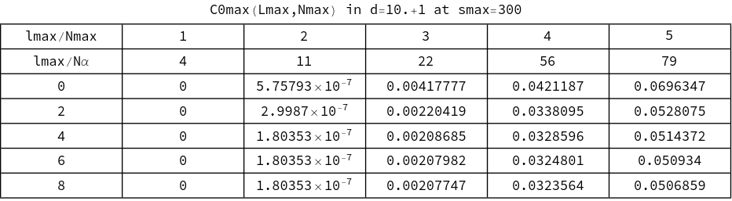

## C0min in d=3,...,11

  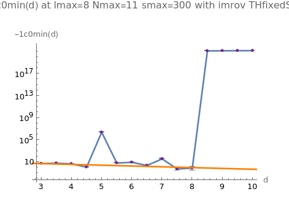

  
  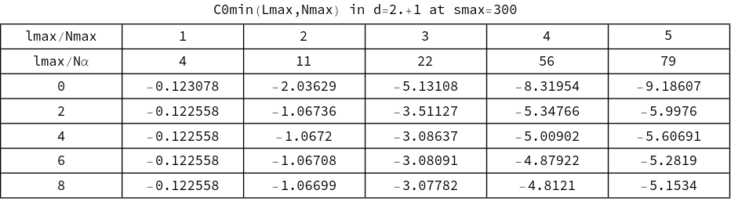

  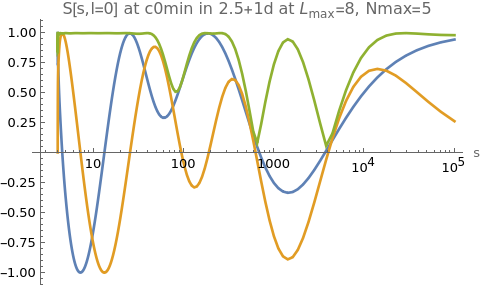
  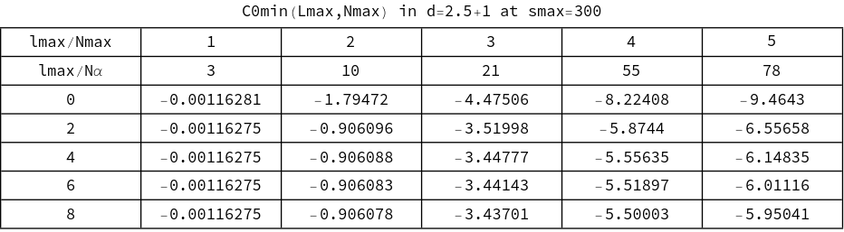

  
  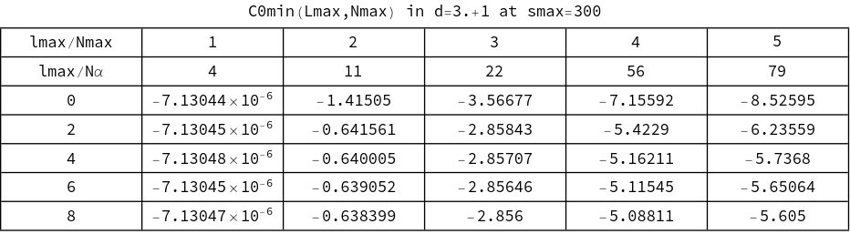

  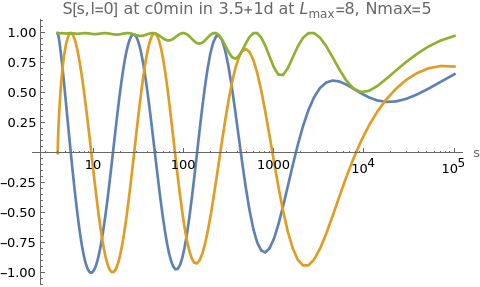
  

  
  

  
  

  
  

  
  

  
  

  
  

  
  

  
  

  
  

